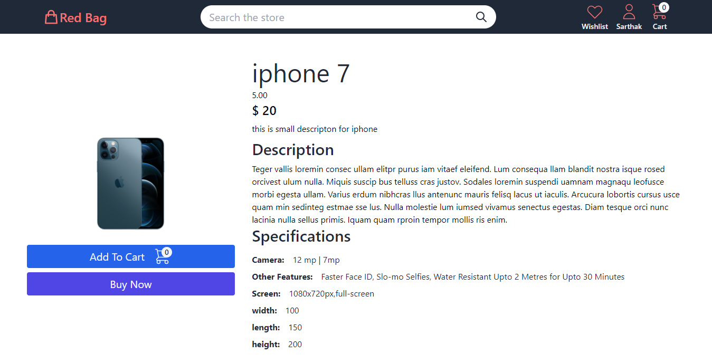
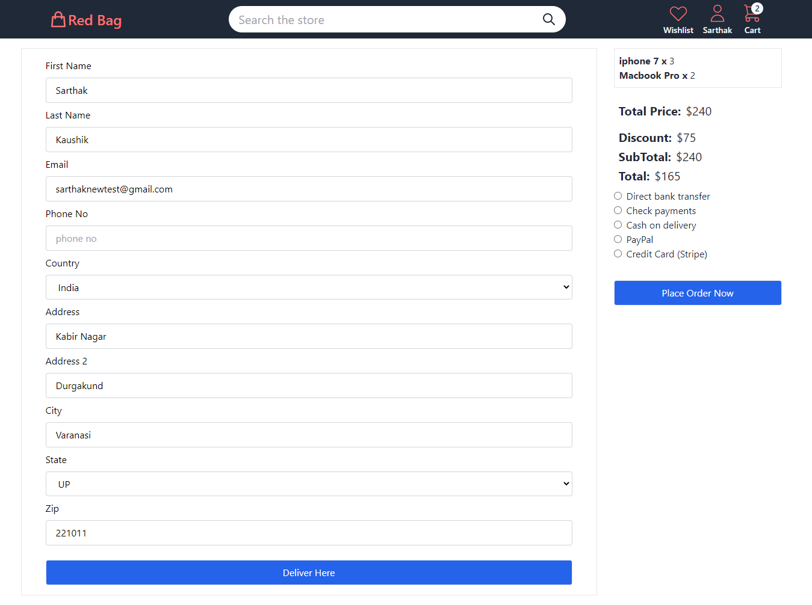
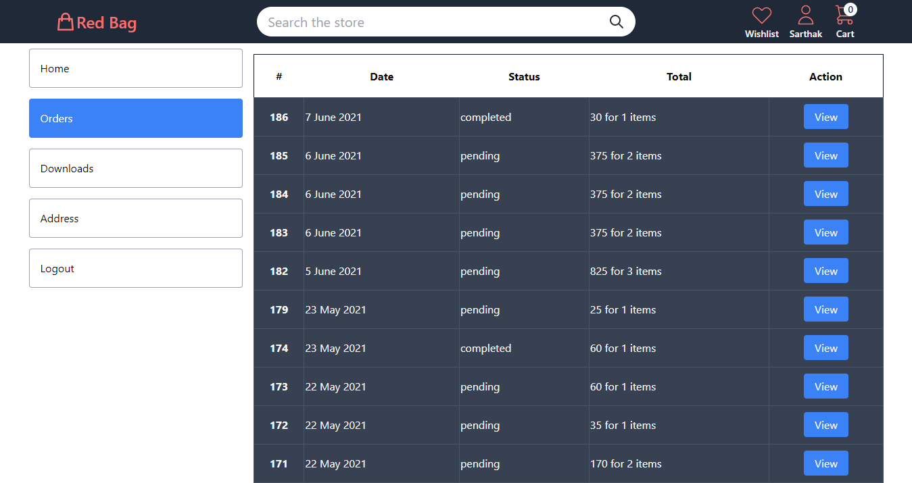

# Ecommerce app Made with Next js and Wordpress

A website made with next js and wordpress as backend.
The backend is running with the help of woocommerce plugin 

[Read More](https://sarthakkaushik.hashnode.dev/next-js-ecommerce-with-wordpress-woocommerce-as-backend)
## Setup 
- Clone the repo 
- Run `yarn install`  to install all required dependencies
- create a new .env.local file and copy from .env file
- follow [this](https://sarthakkaushik.hashnode.dev/next-js-ecommerce-with-wordpress-woocommerce-as-backend) guide to get api keys and copy it to .env.local file

## Home Page

## Product Page

## Cart Page

## Checkout Page

## Customer Order Page

